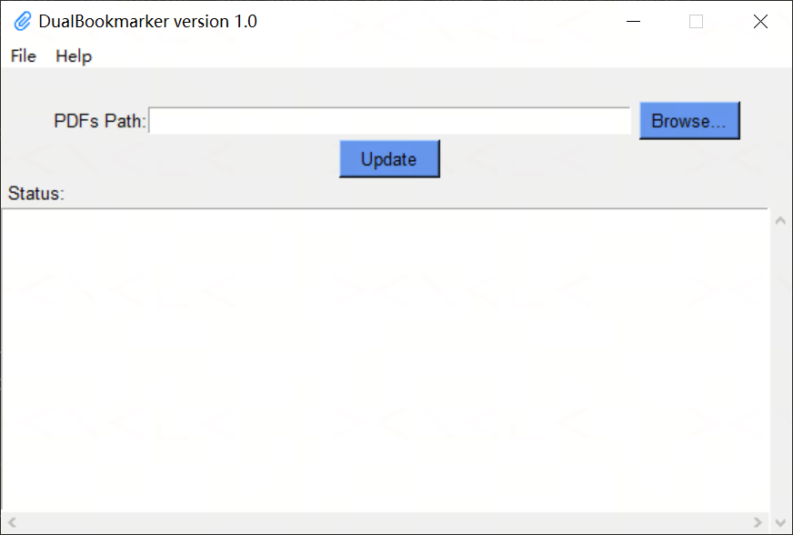

# DualBookmarker

A cross-platform desktop tool (GUI + CLI) to automatically create **dual bookmarks** — BY VISIT and BY DOMAIN — for an annotated CRF (aCRF) PDF, conforming to CDISC SDTM-MSG v2.0 — built with Python and PyMuPDF.

---

## Background

The annotated CRF (aCRF) is a required document for regulatory submissions (FDA, EMA) that maps each CRF field to its corresponding variable in the SDTM dataset. Per the CDISC SDTM Metadata Submission Guidelines v2.0 (SDTM-MSG v2.0), the aCRF should be **dual bookmarked**:

1. **By chronology** — bookmarks ordered by study visit, following the Schedule of Activities (SOA)
2. **By topic/form** — bookmarks ordered alphabetically by form/domain

Both bookmark trees hyperlink to the corresponding aCRF page so reviewers can navigate either way. Creating these bookmarks manually is tedious and error-prone, and existing automation typically depends on commercial Adobe Acrobat plug-ins combined with SAS.

DualBookmarker replaces that workflow with a single Python script: it reads the existing bookmarks from two source PDFs, remaps them into a compliant dual-bookmark tree, runs built-in QC checks, and writes the result back into the aCRF — in seconds, on any platform.

---

## Features

- **Dual bookmark generation** — builds synchronized **BY VISIT** (chronological) and **BY DOMAIN** (alphabetical) trees, both pointing to the correct aCRF pages
- **SDTM-MSG v2.0 compliant** — bookmark structure follows the submission guidelines
- **Automatic cleaning** — drops cover/title bookmarks and self-duplicate entries during extraction
- **Built-in QC** — three automated checks on every run:
  - Visit count match between BY VISIT and the source CRF
  - Domain count match between BY DOMAIN and the aCRF
  - Cross-reference check that every visit under BY DOMAIN exists in BY VISIT
- **Safe re-run guard** — refuses to process an aCRF that is already dual-bookmarked
- **GUI and CLI modes** — same script, same logic
- **Exit codes** — exits with `0` (success) or `1` (failure) for easy pipeline integration

---

## Requirements

| Requirement | Notes |
|---|---|
| Windows / macOS / Linux | Cross-platform (GUI uses Tkinter) |
| Python 3.8+ | |

---

## Installation

```bash
git clone https://github.com/XianhuaZeng/PharmaSUG-China.git
cd PharmaSUG-China/2026/DualBookmarker
pip install -r requirements.txt
```

Key dependency: `PyMuPDF`.

---

## Input files

DualBookmarker needs two PDFs placed in the same folder, with these exact names:

| File | Description |
|---|---|
| `aCRF.pdf` | The annotated CRF containing only the **unique** CRF forms (one page per form), already bookmarked by form name. **This file is updated in place.** |
| `AllCRF.pdf` | The full CRF containing **all pages for all visits**, already bookmarked by visit → form. Used only as a reference for the visit/form structure; not modified. |

---

## Usage

### GUI mode

Double-click `DualBookmarker.py`, or run:

```bash
python DualBookmarker.py
```



**Steps:**
1. Click **Browse…** to select the folder containing `aCRF.pdf` and `AllCRF.pdf`
2. Click **Update** to start the process
3. Progress appears in the status box in real time:
   - Step messages — Extracting, Remapping, Running QC, Applying
   - `[QC PASS]` / `[QC FAIL]` — results for visit count, domain count, and cross-references
   - On success, a clickable link to the updated `aCRF.pdf` is shown

---

### CLI mode

```
python DualBookmarker.py <command> [options]
```

#### Commands

| Command | Description |
|---|---|
| `update` | Generate BY VISIT / BY DOMAIN bookmarks and write them into `aCRF.pdf` |

#### Options for `update`

| Option | Description |
|---|---|
| `-d DIR`, `--dir DIR` | Directory containing `aCRF.pdf` and `AllCRF.pdf` (auto-detected by filename) |
| `--acrf FILE` | Path to `aCRF.pdf` (use together with `--allcrf`) |
| `--allcrf FILE` | Path to `AllCRF.pdf` (required when `--acrf` is used) |
| `--version` | Show version and exit |
| `-h`, `--help` | Show help message |

> `-d` and `--acrf/--allcrf` are mutually exclusive — use one approach per run.

#### Examples

```bash
# Auto-detect aCRF.pdf and AllCRF.pdf from a folder
python DualBookmarker.py update -d C:\study\crf

# Specify files explicitly
python DualBookmarker.py update --acrf C:\study\crf\aCRF.pdf --allcrf C:\study\crf\AllCRF.pdf

# Show version
python DualBookmarker.py --version
```

#### Exit codes

| Code | Meaning |
|---|---|
| `0` | Bookmarks updated successfully |
| `1` | One or more errors occurred |

---

## How it works

The full pipeline runs in four steps:

1. **Extract** — read the bookmark tree from both PDFs via PyMuPDF and write them to intermediate text files (`aCRF.txt`, `AllCRF.txt`), auto-cleaning cover and duplicate entries
2. **Remap** — build the BY VISIT and BY DOMAIN trees and write them to `Final.txt`; both trees reference pages in `aCRF.pdf`
3. **QC** — run three consistency checks against the remapped tree and report `[QC PASS]` / `[QC FAIL]`
4. **Apply** — write the new bookmark tree back into `aCRF.pdf` in place using PyMuPDF's `set_toc` API

---

## File detection (auto-detect mode)

When using `-d DIR`, the tool looks for two files by these exact names in the directory:

- **`aCRF.pdf`** — the annotated unique-forms CRF (receives the new bookmarks)
- **`AllCRF.pdf`** — the full all-visits CRF (reference)

Use `--acrf` / `--allcrf` to specify file paths explicitly if your files are named differently or live in different folders.

---

## Building a standalone executable

```bash
pip install pyinstaller
pyinstaller --onefile --windowed --icon=DualBookmarker.ico DualBookmarker.py
```

The compiled `.exe` will be in the `dist/` folder and requires no Python installation on the target machine.

---

## Project structure

```
DualBookmarker/
├── Testcases/                  # Test input files (aCRF.pdf, AllCRF.pdf)
├── DualBookmarker.py           # Main application (GUI + CLI)
├── DualBookmarker.ico          # Application icon
├── requirements.txt
├── README.md
├── LICENSE
└── docs/
    └── screenshot.png
```

---

## License

MIT License — see [LICENSE](LICENSE) for details.