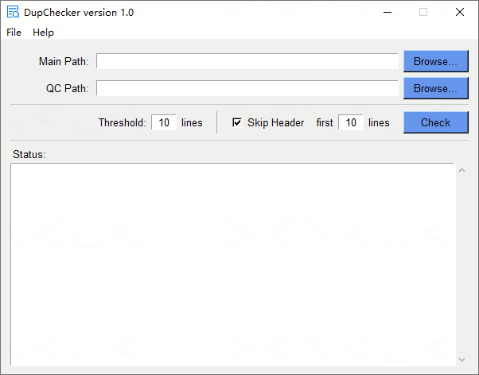

# DupChecker

A Windows desktop GUI tool to **detect duplicate code blocks** between Main and QC SAS programs — built with Python and tkinter.

---

## Features

- Scan two directories of `.sas` files and find duplicate code blocks that appear in both
- Configurable **threshold** — minimum number of consecutive matching lines to flag as a duplicate
- Optional **header skip** — ignore the first N lines of each file (e.g. standard program headers)
- Smart line normalisation before comparison: strips comments, collapses whitespace, ignores curly brackets, and normalises operator spacing
- Case-insensitive comparison
- Automatic encoding detection (UTF-8 BOM / UTF-8 / GBK) for files with Chinese content
- Results saved to **`Duplication.xlsx`** with clickable hyperlinks to each affected file and inline code snippets as cell comments
- Clickable report link in the status area — opens `Duplication.xlsx` directly after the check completes

---

## Requirements

| Requirement | Notes |
|---|---|
| Windows | GUI uses tkinter (bundled with Python) |
| Python 3.8+ | |

---

## Installation

```bash
git clone https://github.com/XianhuaZeng/PharmaSUG.git
cd PharmaSUG/2026/DupChecker
pip install -r requirements.txt
```

Key dependency: `xlsxwriter`.

---

## Usage

Double-click `DupChecker.py`, or run:

```bash
python DupChecker.py
```



### Steps

1. **Main Path** — click **Browse…** to select the folder containing the main SAS programs
2. **QC Path** — click **Browse…** to select the folder containing the QC SAS programs (defaults to Main Path if left blank)
3. Set options (see below)
4. Click **Check** — progress appears in the status area; when complete, the report path is shown as a clickable link

### Options

| Option | Default | Description |
|---|---|---|
| **Threshold** | `10` | Minimum number of consecutive matching lines required to report a duplicate block |
| **Skip Header** | Checked | Skip the first N lines of each file before comparison |
| **first N lines** | `10` | Number of header lines to skip (active only when Skip Header is checked) |

---

## How duplicate detection works

1. Each `.sas` file is read recursively from the given folder; files starting with `~` are skipped
2. Lines are normalised: comments (`/* */` blocks and `*…;` lines) are removed; whitespace is collapsed; curly brackets are stripped; operator spacing is standardised; text is lowercased
3. A sliding window of `threshold` consecutive normalised lines is built for every file in both Main and QC
4. Windows that match between a Main file and a QC file are merged into the longest possible consecutive block using strict aligned merging (both sides must advance in sync)
5. Duplicate blocks are sorted by length (longest first), then by filename and start line

---

## Output report

Results are written to **`Duplication.xlsx`** in the QC path folder.

| Column | Description |
|---|---|
| Dup Lines | Number of duplicate lines in the block |
| File Name | Name of the affected file (hyperlink to open the file) |
| Start Line | First line of the duplicate block |
| End Line | Last line of the duplicate block (hover to see a code snippet) |

When no duplicates are found, the sheet displays a green "No file with duplicate lines" message instead.

---

## Building a standalone executable

```bash
pip install pyinstaller
pyinstaller --onefile --windowed --icon=DupChecker.ico DupChecker.py
```

The compiled `.exe` will be in the `dist/` folder and requires no Python installation on the target machine.

---

## Project structure

```
DupChecker/
├── DupChecker.py        # Main application
├── DupChecker.ico       # Application icon
├── requirements.txt
├── README.md
├── LICENSE
└── docs/
    └── screenshot.png
```

---

## License

MIT License — see [LICENSE](LICENSE) for details.