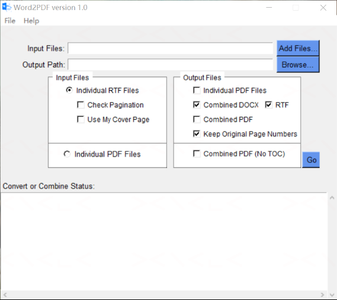

# Word2PDF

A Windows desktop GUI tool to **convert** Word/RTF documents to PDF, **combine** multiple files into a single bookmarked PDF/DOCX/RTF with Table of Contents, and **check RTF pagination** — built with Python and the Word COM interface.

---

## Features

- Convert `.doc`, `.docx`, `.rtf` files to PDF via Microsoft Word
- Combine multiple RTF files into a single output with an auto-generated **Table of Contents** — export as DOCX, RTF, and/or PDF simultaneously
- Combine PDFs or RTFs into a single bookmarked PDF **without** a TOC
- Optional **Cover Page** support (`CoverPage.rtf` or `CoverPage.pdf`)
- **Keep Original Page Numbers** option — each section retains its own page numbering in the combined output
- **Automatic pagination check** before conversion — scans RTF files for mismatches between logical page count (`Sections.Count`) and physical page count (actual rendered pages) and writes a `Pagination.xlsx` report
- Navigation heading injection (`add_nav_to_rtf`) — inserts a hidden Word Nav Pane heading for files that lack one, so all entries appear consistently in the navigation panel
- Chinese content auto-detection (`_is_chinese_rtf`) — switches TOC heading and cover bookmark label to Chinese automatically
- Bookmark ordering via `Bookmark.xls` or automatic natural sort (Table → Figure → Listing)
- PDF/A (ISO 19005-1) output support
- Preserves original file modification timestamps after conversion

---

## Requirements

| Requirement | Notes |
|---|---|
| Windows | Word COM automation is Windows-only |
| Microsoft Word | Must be installed (any version supporting `.ExportAsFixedFormat`) |
| Python 3.8+ | |

---

## Installation

```bash
git clone https://github.com/XianhuaZeng/PharmaSUG.git
cd PharmaSUG/2026/Word2PDF
pip install -r requirements.txt
```

Key dependencies: `pywin32`, `openpyxl`, `xlrd`, `xlsxwriter`, `PyPDF2`.

---

## Usage

Double-click `word2pdf.py`, or run:

```bash
python word2pdf.py
```



### Input / Output panel

1. Click **Add Files…** to select `.doc` / `.docx` / `.rtf` / `.pdf` files
2. Click **Browse…** to choose an output folder (defaults to the input file folder)

### Input Files options (left panel)

| Control | Description |
|---|---|
| **Individual RTF Files** (radio) | Process individual RTF/Word files |
| **Check Pagination** (checkbox) | Scan selected RTF files for pagination issues and save a `Pagination.xlsx` report |
| **Use My Cover Page** (checkbox) | Prepend `CoverPage.rtf` (or `CoverPage.pdf`) to the combined output |

### Output Files options (right panel)

| Control | Description |
|---|---|
| **Individual PDF Files** | Convert each input file to its own PDF |
| **Combined DOCX** | Merge all files into `Combined.docx` with TOC |
| **RTF** | Also save the combined output as `Combined.rtf` |
| **Combined PDF** | Also save the combined output as `Combined.pdf` |
| **Keep Original Page Numbers** | Each section shows its own page numbers (e.g. "Page 1 of 5") rather than the document-wide count |
| **Combined PDF (No TOC)** | Merge files into a single bookmarked PDF without generating a TOC |

### Go

Click **Go** to start the selected operation. Progress and status messages appear in the log area below.

> **Pagination check** runs automatically whenever files are converted. It compares the logical page count (`Sections.Count`) with the physical rendered page count, and saves a `Pagination.xlsx` report. If any RTF file has unbalanced `{` / `}` curly brackets the operation is aborted immediately so you can fix the file first.

---

## Pagination check

Word2PDF checks every RTF file for pagination issues before conversion. It compares:

- **Logical pages** — `Sections.Count` as reported by Word (number of sections)
- **Physical pages** — actual rendered page count (`wdActiveEndPageNumber`)

When a mismatch is detected, the affected file and approximate problem page are highlighted in red in the output report (`Pagination.xlsx`), with a hyperlink that opens the file at the suspect page.

The check also validates that every RTF file has balanced `{` / `}` curly brackets — an unbalanced file will abort the operation immediately.

---

## Combine with TOC

When any of **Combined DOCX / RTF / PDF** is selected, Word2PDF:

1. Reads all RTF files listed in `Bookmark.xls` (or auto-sorted by type and number)
2. Injects a hidden navigation heading into each file that lacks one (`add_nav_to_rtf`)
3. Concatenates all sections into a temporary `Word2PDF_Temp.rtf`
4. Opens the combined RTF in Word, updates the TOC and all fields, then saves to the requested format(s)

The TOC heading is automatically set to **Table of Contents** (English) or **目 录** (Chinese), detected from `Bookmark.xls` column B titles or the content of the first RTF file.

---

## Bookmark ordering

When merging, Word2PDF looks for a `Bookmark.xls` file in the **same folder as the first input file**.

| Column A | Column B |
|---|---|
| File stem (no extension) | Bookmark label / TOC entry shown in the combined output |
| `table1_efficacy` | `Table 1 – Efficacy Summary` |
| `figure2_kaplan` | `Figure 2 – Kaplan-Meier Plot` |

> Note: `Bookmark.xls` uses the legacy `.xls` format (read via `xlrd`).

If `Bookmark.xls` is not found, files are sorted automatically: Tables first, then Figures, then Listings, each group sorted by embedded numbers.

---

## Building a standalone executable

```bash
pip install pyinstaller
pyinstaller --onefile --windowed --icon=Word2PDF.ico word2pdf.py
```

The compiled `.exe` will be in the `dist/` folder and requires no Python installation on the target machine (Microsoft Word is still required).

---

## Project structure

```
Word2PDF/
├── testcases/         # Test input files
├── Word2PDF.py        # Main application (GUI)
├── Word2PDF.ico       # Application icon
├── requirements.txt
├── README.md
├── LICENSE
└── docs/
    └── screenshot.png
```

---

## License

MIT License — see [LICENSE](LICENSE) for details.